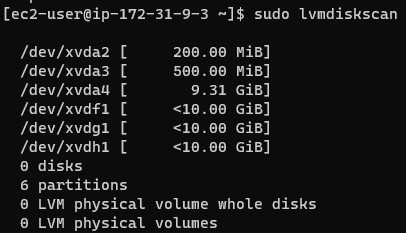

## Implementing a basic web solution using WordPress ##

In this tutorial you will be shown how to prepare storage infrastructure on two Linux servers and implement a basic web solution using WordPress. WordPress is a free and open-source content management system written in PHP and paired with MySQL or MariaDB as its backend Relational Database Management System (RDBMS).

Project 6 consists of two parts:

Configure storage subsystem for Web and Database servers based on Linux OS. The focus of this part is to give you practical experience of working with disks, partitions and volumes in Linux.

Install WordPress and connect it to a remote MySQL database server. This part of the project will solidify your skills of deploying Web and DB tiers of Web solution.

As a DevOps engineer, your deep understanding of core components of web solutions and ability to troubleshoot them will play essential role in your further progress and development.

**Three-tier Architecture**
Generally, web, or mobile solutions are implemented based on what is called the **Three-tier Architecture**.

**Three-tier Architecture** is a client-server software architecture pattern that comprise of 3 separate layers.

**Presentation Layer (PL)**: This is the user interface such as the client server or browser on your laptop.
**Business Layer (BL)**: This is the backend program that implements business logic. Application or Webserver
**Data Access or Management Layer (DAL)**: This is the layer for computer data storage and data access. Database Server or File System Server such as FTP server, or NFS Server

In this project, you will have the hands-on experience that showcases **Three-tier Architecture** while also ensuring that the disks used to store files on the Linux servers are adequately partitioned and managed through programs such as gdisk and LVM respectively.

Requirements:

**Your 3-Tier Setup**
- A Laptop or PC to serve as a client

- An EC2 Linux Server as a web server (This is where you will install WordPress)

- An EC2 Linux server as a database (DB) server

**Note**: We are using RedHat OS for this project, you should be able to spin up an EC2 instance on your own. Also when connecting to RedHat you will need to use ec2-user user. Connection string will look like ec2-user@public-ip-address.

**Step 1**

## Launch an EC2 instance that will server as Webserver 

1. Launch an EC2 instance that will serve as "Web Server". Create 3 volumes in the same AZ as your Web Server EC2, each of 10 GiB.

    

    

2. Open up the Linux terminal to begin configuration, use `lsblk` command to inspect what block devices are attached to the server. Notice names of your newly created devices. All devices in Linux reside in /dev/ directory. Inspect it with ls /dev/ and make sure you see all 3 newly created block devices there – their names will likely be xvdf, xvdh, xvdg.

    

3. Use `df -h` command to see all mounts and free space on your server.

    

4. Use the fdisk utility to create a single partition on each of the 3 disks `sudo fdisk /dev/xvdf`. Repeat the steps for xvdg and xvdh

    

5. Use `lsblk` utility to view the newly configured partition on each of the 3 disks.

    

6. Install lvm2 package using `sudo yum install lvm2`. Run `sudo lvmdiskscan` command to check for available partitions.

    

    

7. Use pvcreate utility to mark each of 3 disks as physical volumes (PVs) to be used by LVM

    `sudo pvcreate /dev/xvdf1`
    `sudo pvcreate /dev/xvdg1`
    `sudo pvcreate /dev/xvdh1`

      

8. Verify that your Physical volume has been created successfully by running `sudo pvs`

    

9. Use vgcreate utility to add all 3 PVs to a volume group (VG). Name the VG webdata-vg - `sudo vgcreate webdata-vg /dev/xvdh1 /dev/xvdg1 /dev/xvdf1`

    

10. Verify that your VG has been created successfully by running `sudo vgs`

     

11. Use lvcreate utility to create 2 logical volumes. apps-lv (Use half of the PV size), and logs-lv Use the remaining space of the PV size. NOTE: apps-lv will be used to store data for the Website while, logs-lv will be used to store data for logs.

    `sudo lvcreate -n apps-lv -L 14G webdata-vg`
    `sudo lvcreate -n logs-lv -L 14G webdata-vg`

    

12. Verify that your Logical Volume has been created successfully by running `sudo lvs`

    

13. Verify the entire setup

    `sudo vgdisplay -v #view complete setup - VG, PV, and LV`
    `sudo lsblk`

    

14. Use mkfs.ext4 to format the logical volumes with ext4 filesystem

    `sudo mkfs -t ext4 /dev/webdata-vg/apps-lv`
    `sudo mkfs -t ext4 /dev/webdata-vg/logs-lv`

    

15. Create /var/www/html directory to store website files
    `sudo mkdir -p /var/www/html`

    

16. Create /home/recovery/logs to store backup of log data

    `sudo mkdir -p /home/recovery/logs`

    

17. Mount /var/www/html on apps-lv logical volume

    `sudo mount /dev/webdata-vg/apps-lv /var/www/html/`

    

18. Use rsync utility to backup all the files in the log directory /var/log into /home/recovery/logs (This is required before mounting the file system)

    `sudo rsync -av /var/log/. /home/recovery/logs/`

    

19. Mount /var/log on logs-lv logical volume. (Note that all the existing data on /var/log will be deleted. That is why step 15 above is very important)

      `sudo mount /dev/webdata-vg/logs-lv /var/log`

      

20. Restore log files back into /var/log directory

    `sudo rsync -av /home/recovery/logs/. /var/log`

    

21. Update /etc/fstab file so that the mount configuration will persist after restart of the server.

    The UUID of the device will be used to update the /etc/fstab file;

    `sudo blkid`

    

    `sudo vi /etc/fstab`

    Update /etc/fstab in this format using your own UUID and rememeber to remove the leading and ending quotes.

    

    1.  Test the configuration and reload the daemon

         `sudo mount -a`
        
        `sudo systemctl daemon-reload`

        

    2.  Verify your setup by running `df -h`, output must look like this:

        

## Step 2 

**Prepare the Database Server**

1. Launch a second RedHat EC2 instance that will have a role – ‘DB Server’

2. Repeat the same steps as for the Web Server, but instead of `apps-lv` create `db-lv` and mount it to `/db` directory instead of `/var/www/html/`.

    

## Step 3

**Install WordPress on your Web Server EC2**

1. Update the repository

    `sudo yum -y update`

    

2. Install wget, Apache and it’s dependencies

    `sudo yum -y install wget httpd php php-mysqlnd php-fpm php-json`

    

3. Start Apache

    `sudo systemctl enable httpd` 
    
    `sudo systemctl start httpd`

    

4. To install PHP and it’s dependencies

    `sudo yum install https://dl.fedoraproject.org/pub/epel/epel-release-latest-8.noarch.rpm`
    
    `sudo yum install yum-utils http://rpms.remirepo.net/enterprise/remi-release-8.rpm`

    `sudo yum module list php`

    `sudo yum module reset php`

    `sudo yum module enable php:remi-7.4`

    `sudo yum install php php-opcache php-gd php-curl php-mysqlnd`

    `sudo systemctl start php-fpm`

    `sudo systemctl enable php-fpm`

    `sudo setsebool -P httpd_execmem 1`

    

5. Restart Apache

    `sudo systemctl restart httpd`

    

6. Download wordpress and copy wordpress to var/www/html

    `mkdir wordpress`

    `cd   wordpress`

    `sudo wget http://wordpress.org/latest.tar.gz`

    `sudo tar xzvf latest.tar.gz`

    `sudo rm -rf latest.tar.gz`

    `sudo cp wordpress/sudo wp-config-sample.phpwordpress/wp-config.php`

    `sudo cp -R wordpress /var/www/html/`

    

7. Configure SELinux Policies

    `sudo chown -R apache:apache /var/www/html/wordpress`

    `sudo chcon -t httpd_sys_rw_content_t /var/www/html/wordpress -R`

    `sudo setsebool -P httpd_can_network_connect=1`

    

## Step 4

1. Install MySQL on your DB Server EC2**

    `sudo yum update`
    `sudo yum install mysql-server`

    

2. Verify that the service is up and running by using `sudo systemctl status mysqld`, if it is not running, restart the service and enable it so it will be running even after reboot:

    `sudo systemctl restart mysqld`

    `sudo systemctl enable mysqld`

    

## Step 5 ## 

Configure DB to work with WordPress

`sudo mysql`

`CREATE DATABASE wordpress;`

`CREATE USER `myuser`@`<Web-Server-Private-IP-Address>` IDENTIFIED BY 'mypass';`

`GRANT ALL ON wordpress.* TO 'myuser'@'<Web-Server-Private-IP-Address>';`

`FLUSH PRIVILEGES;`

`SHOW DATABASES;`

`exit`

## Step 6 ## 

Configure WordPress to connect to remote database.

**Note**: Open MySQL port 3306 on DB Server EC2. For extra security, to allow access to the DB server ONLY from your Web Server’s IP address, so in the Inbound Rule configuration specify source as /32.

1. Install MySQL client and test that you can connect from your Web Server to your DB server by using mysql-client

    `sudo yum install mysql`

    `sudo mysql -u myuser -p -h <DB-Server-Private-IP-address>`

    

    

2. Change permissions and configuration so Apache could use WordPress:

    Here we need to create a configuration file for wordpress in order to point client requests to the wordpress directory.

    `sudo vi /etc/httpd/conf.d/wordpress.conf`

    

    copy and paste the lines below:

        <VirtualHost *:80>
        ServerAdmin myuser@3.88.215.221
        DocumentRoot /var/www/html/wordpress

        <Directory "/var/www/html/wordpress">
        Options Indexes FollowSymLinks
        AllowOverride all
        Require all granted
        </Directory>

        ErrorLog /var/log/httpd/wordpress_error.log
        CustomLog /var/log/httpd/wordpress_access.log common
        </VirtualHost>

    

3. Restart Apache 

    `sudo systemctl restart httpd`

    

4. Edit the wp-config file

    `sudo vi /var/www/html/wordpress/wp-config.php`

    add the following values

        define('DB_NAME', 'wordpress');
        define('DB_USER', 'myuser');
        define('DB_PASSWORD', 'mypass');
        define('DB_HOST', '<db-Server-Private-IP-Address>');
        define('DB_CHARSET', 'utf8mb4');
        define('DB_COLLATE', '');

    

5. Configure SELinux for wordpress

    `sudo semanage fcontext -a -t httpd_sys_rw_content_t "/var/www/html/wordpress/.*?"`

    

 6. Try to access from your browser the link to your WordPress

    `http://<Web-Server-Public-IP-Address>/`

    
